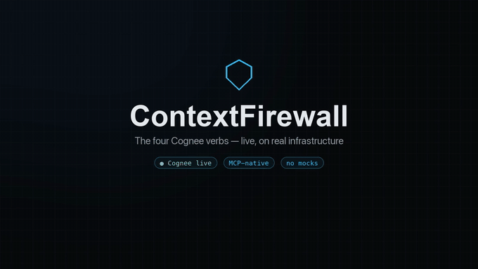
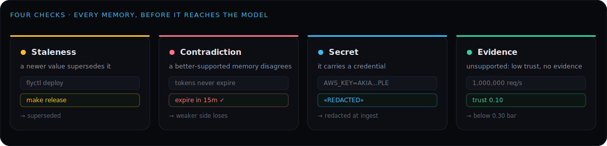
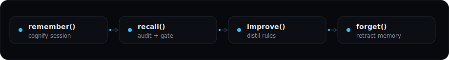

<div align="center">



<br/>

**A trust firewall for your AI coding agent's memory.**
Every memory your agent recalls, stores, distils, or forgets flows through [Cognee](https://github.com/topoteretes/cognee) and four firewall checks — so stale, contradicted, secret-bearing, and unsupported memory never reaches the model.

<br/>

[](https://github.com/topoteretes/cognee)
[](https://modelcontextprotocol.io)
[](backend)
[](frontend)
[](#evidence-real-runs-no-mocks)
[](https://himanshukumarjha-contextfirewall.hf.space/health)

**[◆ Live console](https://contextfirewall.vercel.app)**  ·  **[⚡ MCP endpoint](https://himanshukumarjha-contextfirewall.hf.space/mcp)**  ·  **[📖 API docs](https://himanshukumarjha-contextfirewall.hf.space/docs)**

<sub>Built for the **WeMakeDevs × Cognee** hackathon — *The Hangover Part AI: Where's My Context?* (Jun 29 – Jul 5, 2026)</sub>

<br/><br/>

### ▶ See it work — the four Cognee verbs, live

<a href="https://github.com/himanshu748/ContextFirewall/raw/main/.github/assets/demo.mp4"></a>

<sub>▲ real console, real Cognee calls (Neo4j · Postgres · pgvector · Qwen2.5-72B) — no mocks · **[full-resolution MP4 ↗](https://github.com/himanshu748/ContextFirewall/raw/main/.github/assets/demo.mp4)** · [40s brand teaser ↗](https://github.com/himanshu748/ContextFirewall/raw/main/.github/assets/launch.mp4)</sub>

</div>

---

## The problem

AI coding agents are getting long-term memory. But memory that is **stale, contradicted, leaked, or unproven** is worse than no memory — it silently steers the next agent wrong:

- a remembered `deploy` command that changed last week,
- a "fix" that was later disproven,
- an API key captured in a transcript,
- a confident claim with no evidence behind it.

Today, all of these flow straight back into the next session's context. **ContextFirewall audits every remembered fact before it is reused, and gives you a forget control** — dropping into any MCP-capable agent stack in one line.

<div align="center">

</div>

| Check | A memory is **blocked** when… |
|------|------------------------------|
| 🟡 **Staleness / validity** | a newer value supersedes it (the deploy target changed) |
| 🔴 **Contradiction** | a better-supported memory disagrees (the weaker side loses, the winner passes) |
| 🔵 **Secret / sensitivity** | it carries a credential — redacted **at ingest**, so it never persists and never reaches the pack |
| 🟢 **Evidence / trust** | it is unsupported: a low trust score with no evidence recorded in the session |

Only memories that pass **all four** are assembled into a **trusted context pack**. The ungoverned raw recall is shown side by side, so you can see exactly what the firewall kept out. A human — or the agent, via `forget_memory` — can retract any memory; it is deleted from Cognee so it can never resurface.

---

## Connect your agent (MCP)

ContextFirewall is a Model Context Protocol server with **two transports and one identical six-tool surface**, so it drops into whatever agent you use.

**Claude Code — hosted (one line, no install):**

```bash
claude mcp add --transport http contextfirewall https://himanshukumarjha-contextfirewall.hf.space/mcp
```

**Claude Code — local & private (`uvx`, nothing leaves your machine):**

```bash
claude mcp add contextfirewall \
  --env CF_API_BASE=https://himanshukumarjha-contextfirewall.hf.space \
  -- uvx --from "git+https://github.com/himanshu748/ContextFirewall#subdirectory=mcp" contextfirewall-mcp
```

**Cursor / Cline / generic (`~/.cursor/mcp.json` or `mcp.json`):**

```json
{ "mcpServers": { "contextfirewall": { "url": "https://himanshukumarjha-contextfirewall.hf.space/mcp" } } }
```

**Windsurf (`~/.codeium/windsurf/mcp_config.json`)** — the key is `serverUrl`, not `url`:

```json
{ "mcpServers": { "contextfirewall": { "serverUrl": "https://himanshukumarjha-contextfirewall.hf.space/mcp" } } }
```

### The six tools

| Tool | Cognee verb | What it does |
|------|-------------|--------------|
| `get_trusted_context(task)` | recall | Returns a trusted context pack: only memories that pass all four checks. |
| `audit_context(task)` | recall | Per-memory verdicts — approved, blocked, the failing check and why, plus the `memory_id`. |
| `remember(text, subject, kind)` | remember | Store a durable fact; auditable on the next recall. Secrets are redacted at ingest. |
| `forget_memory(memory_id)` | forget | Delete a memory from the graph **and** the vector store so it can never resurface. |
| `improve_rules()` | improve / memify | Distil reusable `Rule` nodes from recorded sessions. |
| `list_coding_rules(query)` | recall | Retrieve the distilled coding rules (`CODING_RULES` search). |

> **The loop:** call `get_trusted_context` before you act, `remember` durable facts as you learn them, `improve_rules` when a task is done, and `forget_memory` to retract anything that should never come back.

Full client setup and privacy notes are in [`mcp/README.md`](mcp/README.md).

---

## Built on Cognee's full memory lifecycle

<div align="center">

</div>

ContextFirewall exercises **all four** Cognee verbs, and every MCP tool maps onto one. Depth here is the point.

| Verb | How ContextFirewall uses it |
|------|------------------------------|
| **Remember** | `cognee.add` + `cognify` build the entity graph from a session transcript, plus a typed `Repo → AgentSession → SessionEvent → Memory` graph (with `supersedes` relations) so the firewall has deterministic objects to audit. `remember(...)` is the single-shot path. |
| **Recall** | `cognee.search` (`GRAPH_COMPLETION`) for the ungoverned baseline, plus vector recall over the memory nodes joined with their graph properties to gather the candidates the firewall audits. |
| **Improve** | `memify` distils durable `Rule` nodes into the `coding_agent_rules` node set, retrievable via `SearchType.CODING_RULES`; trust scores are derived from evidence and reinforcement. |
| **Forget** | governance: a rejected or blocked memory is removed from both the graph and the vector store. |

The graph is **load-bearing**: staleness rides on temporal supersession, contradiction is adjudicated within a recalled cluster of same-subject memories, and the trusted pack is assembled from typed nodes — not a flat vector list.

---

## Privacy first

Privacy isn't a feature bolted on — it's how the data path is built.

- 🔒 **Secrets are redacted at ingest, then again on every read.** When a session is remembered, any detected credential (API key, DB URI, private key, AWS key, JWT, `secret=…` assignment, high-entropy token) is stripped **before** it is written to the graph, the vector store, or the cognified transcript. It never persists — and the firewall still blocks the memory it came from. Every read path (`/audit`, `/pack`, `/graph`, recall) redacts again as a second, defense-in-depth layer.
- 🧭 **Local by default.** In dev, Cognee's stores are local files (SQLite + LanceDB + the default graph); by default the model and embeddings still call the Hugging Face router, but point them at a local OpenAI-compatible endpoint (see the Local model option below) and nothing leaves the machine. Managed Neo4j Aura + Supabase pgvector are only for the hosted demo; self-host and your memory graph stays yours.
- 🧩 **Per-account namespace isolation.** An authenticated caller's API key resolves to a private namespace; reads are scoped to **that namespace only** — your console never mixes in the public sample data. Supabase RLS locks the underlying tables.
- 💻 **Local model option.** Model and embedding endpoints are env-configurable — point them at a local OpenAI-compatible server (e.g. Ollama) for a fully offline deployment.

See [`backend/app/firewall/secrets.py`](backend/app/firewall/secrets.py) for the detector and [`backend/app/identity.py`](backend/app/identity.py) for namespace resolution.

---

## Architecture

```
Claude Code · Cursor · Windsurf · Cline · any MCP client
                          │
                          ▼
┌──────────────────────────────────────────────────────────────┐
│ MCP server   /mcp   (streamable HTTP, stateless)             │
│ REST API     /pack /audit /remember /forget ...              │
├──────────────────────────────────────────────────────────────┤
│       one firewall core → 4 checks → trusted pack            │
├──────────────────────────────────────────────────────────────┤
│ Cognee  =  graph + vector + relational store                 │
└──────────────────────────────────────────────────────────────┘
                          ▲
                          │
Live console (Next.js / Vercel) ──────────────┘

        dev:  SQLite · LanceDB · Kuzu graph   │   prod:  Neo4j Aura · Supabase pgvector
```

- **MCP server** — the headline surface, mounted at `/mcp` (streamable HTTP, stateless), plus a zero-dependency `uvx` stdio package under [`mcp/`](mcp) for laptops. Both expose the same six tools from one definition.
- **Backend** — FastAPI + Cognee SDK (Python 3.12), deployed as a Docker **Hugging Face Space**. MCP tools and REST endpoints call **one** firewall/Cognee core — no duplicated logic.
- **Model layer** — Hugging Face inference router: **Qwen2.5-72B-Instruct** for graph extraction and contradiction adjudication, **BAAI/bge-small-en-v1.5** embeddings (384-dim).
- **Storage** — env-switched in `bootstrap.py`: local stores in dev, Supabase Postgres + pgvector and Neo4j Aura in prod. Identical code.
- **Frontend** — Next.js + Tailwind on **Vercel**: an interactive force-directed knowledge graph, the Connect view, session replay, and a polling firewall activity feed.

### API

The MCP tools are the primary surface; these REST endpoints back them and power the console.

| Method | Path | Purpose |
|--------|------|---------|
| `ANY` | `/mcp` | **MCP server (streamable HTTP): the six firewall tools** |
| `GET` | `/health` | live profile (providers, model) + node counts |
| `POST` | `/pack` | gated trusted context pack (and the ungoverned baseline) |
| `POST` | `/audit` | recall + run the four checks, per-memory verdicts |
| `POST` | `/remember` · `/ingest` | remember one fact / a recorded session |
| `POST` | `/improve` · `GET /rules` | distil coding rules (memify) / recall them |
| `POST` | `/forget` | delete a memory from Cognee (governance) |
| `GET` | `/graph` · `/activity` | knowledge-graph nodes+edges / live firewall feed |
| `GET` | `/sessions/{id}/timeline` | session replay |
| `POST` | `/demo/seed` | ingest the bundled sample session (idempotent) |

Try the trusted pack against the live API:

```bash
curl -s -X POST https://himanshukumarjha-contextfirewall.hf.space/pack \
  -H 'content-type: application/json' \
  -d '{"query": "How do I deploy taskflow-api safely?"}'
```

---

## Run locally

```bash
# Backend
cd backend
uv venv --python 3.12 .venv && uv pip install -r requirements.txt
cp .env.example .env        # add your Hugging Face API key
set -a && . ./.env && set +a
PYTHONPATH=. .venv/bin/python scripts/dev_integration.py   # end-to-end check on real Cognee
PYTHONPATH=. .venv/bin/uvicorn app.main:app --port 8000     # MCP at /mcp, API at /

# Frontend
cd frontend
npm install
echo "NEXT_PUBLIC_API_URL=http://localhost:8000" > .env.local
npm run dev
```

For local dev you only need a Hugging Face API key; Cognee uses local file stores. Set the Postgres/pgvector/Neo4j variables and the same code externalizes storage.

---

## The demo data — and what is real

The bundled demo is a **sample agent session on a fictional `taskflow-api` repo** (FastAPI, Postgres, Redis, Stripe). An agent onboards and picks up a search-latency ticket. The ten memories are clearly-illustrative **inputs**, engineered so each check is exercised:

- **Staleness** — `flyctl deploy --remote-only` (Feb) is superseded by `make release` (Jun).
- **Contradiction** — "JWT access tokens never expire" (trust 0.45) loses to "expire after 15 minutes, use the refresh flow" (verified).
- **Secret** — an AWS access key in a worker-config note is detected and redacted (`AKIA…PLE`).
- **Evidence** — "`/search` sustains 1,000,000 req/s, no caching" is unsupported (trust 0.10) and blocked.

Everything **downstream of those inputs is real system output**: the verdicts, trust scores, the knowledge graph, the distilled rules, and the trusted pack all come from live Cognee and the live model. No verdict is hard-coded, and no results are fabricated.

### Evidence (real runs, no mocks)

- The full MCP verb cycle is validated over **both** transports on real Cognee + Hugging Face: `get_trusted_context` / `audit_context` return **6 approved and 4 blocked** for exactly the right reasons; `remember` adds an auditable memory; `improve_rules` distils real `Rule` nodes; `forget_memory` removes from graph and vector.
- `scripts/mcp_http_probe.py` and `scripts/mcp_full_probe.py` exercise the hosted endpoint; `mcp/tests/test_mcp.py` covers the stdio path and the protocol handshake.
- `cognify` runs live on Qwen2.5-72B; `GRAPH_COMPLETION` reasons correctly over the temporal deploy-command change.
- **35 unit tests pass** (`tests/test_secrets.py`, `test_checks.py`, `test_identity.py`, `test_namespace.py`).
- Production runs on managed stores: `/health` reports `graph: neo4j`, `relational: postgres`, `vector: pgvector`.

---

## Roadmap

- **Trust re-weighting over time** — reinforce memories that prove correct, decay those that don't.
- **Continuous auto-recording** of live agent sessions, instead of explicit `remember` calls.
- **Cross-session accumulating memory** with the firewall governing the growing graph.
- **Managed Cognee Cloud** as a hosting option alongside self-host.

---

<div align="center">

<sub>Built with AI assistance (**Hyperagent**), disclosed per the hackathon rules. All Cognee usage is real — live model and graph calls, not mocked. The demo session is a clearly-labeled sample; every firewall verdict shown is genuine system output.</sub>

<br/>

**[◆ Open the console](https://contextfirewall.vercel.app)** · **[⚡ Connect over MCP](https://himanshukumarjha-contextfirewall.hf.space/mcp)** · **[🛡️ Source](https://github.com/himanshu748/ContextFirewall)**

</div>
